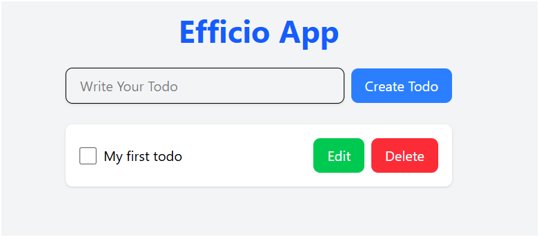

# Efficio - A Modern Todo App

Efficio is a simple, user-friendly Todo application built using React. It allows users to efficiently manage their tasks by creating, editing, saving, deleting, and marking tasks as completed. The app ensures a seamless and interactive experience with persistent local storage support.

---

## Features

- **Create Todos**: Add new tasks to your todo list.
- **Edit Todos**: Modify existing tasks with ease.
- **Save Todos**: Save changes to tasks after editing.
- **Delete Todos**: Remove tasks that are no longer needed.
- **Mark as Completed**: Check off tasks when they are done.
- **Persistent Storage**: Todos are saved in the browser's local storage to maintain state across sessions.

---

## Tech Stack

- **Frontend**: React (with functional components and hooks)
- **Styling**: Tailwind CSS for modern and responsive UI design
- **State Management**: React's `useState` hook
- **Unique Identifiers**: `uuid` library for generating unique IDs for todos
- **Local Storage**: For data persistence

---

## Installation and Setup

### Prerequisites

- Node.js (v14 or later)
- npm or yarn

### Steps

1. **Clone the Repository**
   ```bash
   git clone https://github.com/gautamaggarwaldev/react-todo-webApp.git
   cd todo-webApp
   ```

2. **Install Dependencies**
   ```bash
   npm install
   # or
   yarn install
   ```

3. **Run the App**
   ```bash
   npm run dev
   # or
   yarn start
   ```
   The app will be available at `http://localhost:5173`.

4. **Build for Production**
   ```bash
   npm run build
   # or
   yarn build
   ```

---

## File Structure

```plaintext
src/
├── components/
│   ├── CreateTodo.jsx        # Component for creating new todos
│   ├── TodoListComponent.jsx # Component for displaying and managing individual todos
├── App.jsx                   # Main app component
├── index.css                 # Global styles
├── main.jsx                  # Entry point
└── App.css                   # Component-specific styles
```

---

## Usage

1. Open the app in your browser.
2. Use the input field to create new todos and click "Create Todo".
3. Edit, save, or delete todos using the respective buttons.
4. Mark tasks as completed using the checkbox.
5. Your todos will remain saved even after refreshing the page.

---

## Screenshots

### Main Interface


### Checkbox


### Edit Todo


### Save Todo


---

## Contributing

Contributions are welcome! To contribute:

1. Fork the repository.
2. Create a new branch for your feature or bug fix:
   ```bash
   git checkout -b feature-name
   ```
3. Commit your changes:
   ```bash
   git commit -m "Add your message here"
   ```
4. Push your branch:
   ```bash
   git push origin feature-name
   ```
5. Open a Pull Request.

---


## Acknowledgments

- Built with love using React and Tailwind CSS.
- Inspired by the need for simple and efficient task management.

---

## Contact

For any questions or feedback, feel free to reach out:
- **Email**: gautam.aggarwal.tech@gmail.com
- **GitHub**: [gautamaggarwaldev](https://github.com/gautamaggarwaldev)

