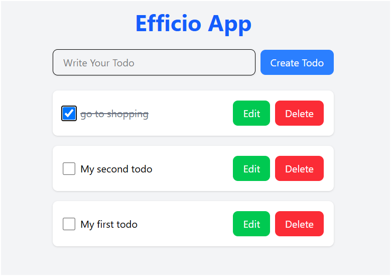
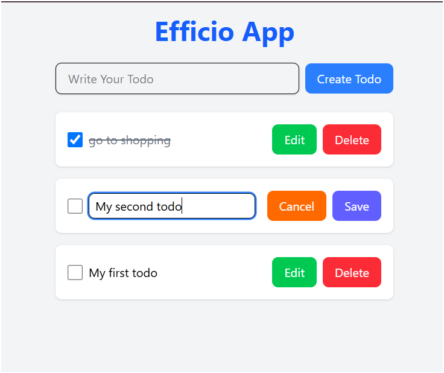
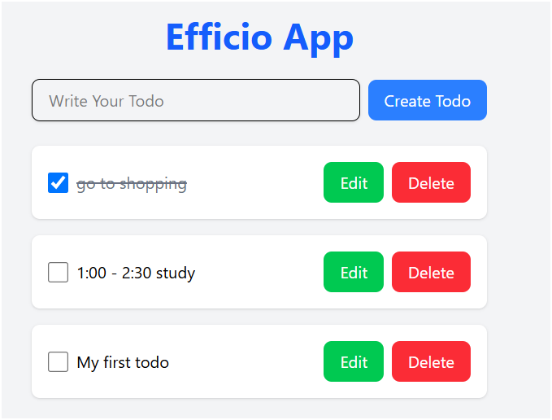

That sounds like a fantastic project! Here's a detailed and professional README.md file for your Efficio todo app:

```markdown
# Efficio Todo App

Efficio is a React-based todo application that helps users manage their tasks efficiently. Users can create, edit, save, delete, and mark tasks as complete. 

## Features

- **Create Todo**: Add new tasks easily.
- **Edit Todo**: Modify existing tasks.
- **Save Todo**: Save tasks to keep track of them.
- **Delete Todo**: Remove tasks that are no longer needed.
- **Mark as Complete**: Check off tasks once they are completed.

## Images

[todo](src/assets/image.png)




## Installation

Follow these steps to install and run the Efficio app locally:

1. **Clone the repository**:
   ```bash
   git clone https://github.com/gautamaggarwaldev/react-todo-webApp.git
   ```

2. **Navigate to the project directory**:
   ```bash
   cd todo-webApp
   ```

3. **Install the dependencies**:
   ```bash
   npm install
   ```

4. **Start the development server**:
   ```bash
   npm run dev
   ```

The app will be available at `http://localhost:5173`.

## Usage

### Creating a Todo

1. Click on the "Add Todo" button.
2. Enter your task in the input field.
3. Click "Save" to add the task to the list.

### Editing a Todo

1. Click on the task you want to edit.
2. Modify the task in the input field.
3. Click "Save" to update the task.

### Deleting a Todo

1. Click the "Delete" button next to the task you want to remove.

### Marking a Todo as Complete

1. Click the checkbox next to the task to mark it as complete.

## Contributing

We welcome contributions! Please follow these guidelines:

1. Fork the repository.
2. Create a new branch for your feature or bugfix.
3. Commit your changes with clear messages.
4. Push your changes to your fork.
5. Create a pull request to the main repository.


## Acknowledgements

- React
- npm
- uuid

---

Feel free to customize this README.md file further based on any specific details or additional features your app might have.
```

I hope this helps! If you have any other specifics you'd like included, just let me know.